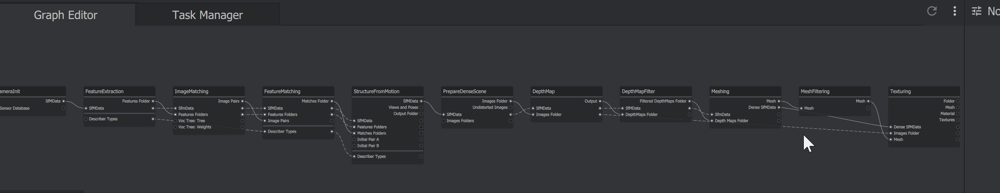
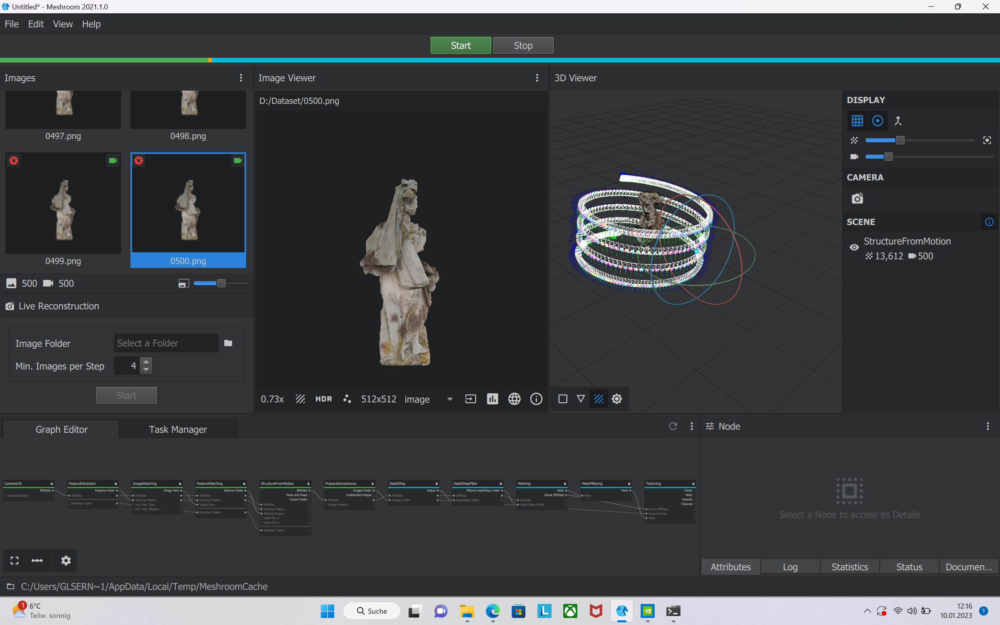
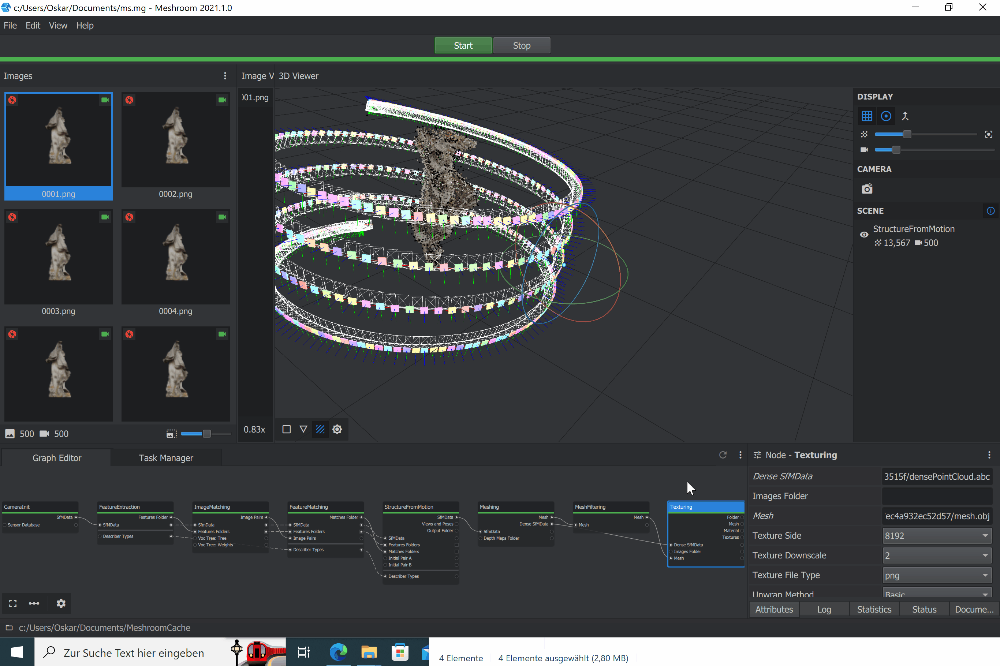

# Mehsroom-tut
---
## 1. Bilder hinzufügen

Zuerst müssen die Bilder die für den 3D-Scan verwendet werden sollen in die Bilder-Ablage Gezogen werden.

## 1.1 (nur für nutzer ohne Nvidia Grafikkarte)

Die 3 Nodes mit den Tieln: "PrepareDenseScene", "DepthMap" und "DepthMapFilter" müssen entfernt werden, da diese eine Cuda-Fähige (Nvidia) Graffikarte benötigen. Die Nodes können mit einem Rechtsklick und einem Folge-Klick auf "Delete Node" Gelöscht Werden.

Danach müssen die punkte "SFMData" der Node "StructureFromMotion" und der punkt "SFMData" der Node "Meshing" verbunden werden.

## 2

Jetzt kann der Start Knopf betätigt werden. Danach hat man die Möglichkeit das Projekt zu speichern.

Nun wird das 3D model erstellt, das ganze ist fertig wenn der Balken oben am Bildschirm komplett Grün ist.

## 3

