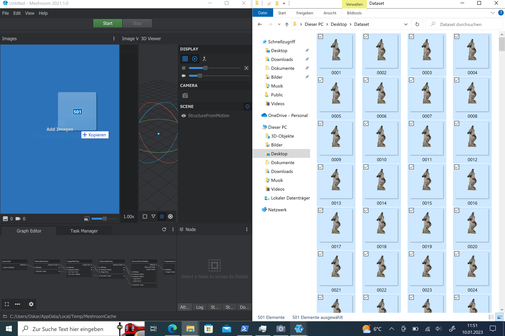
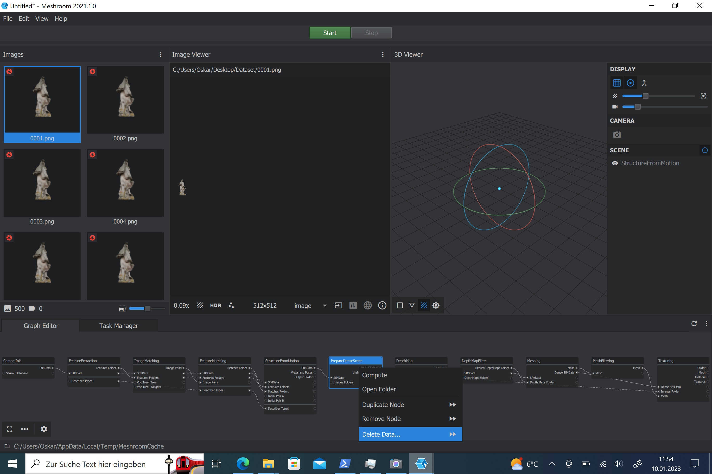
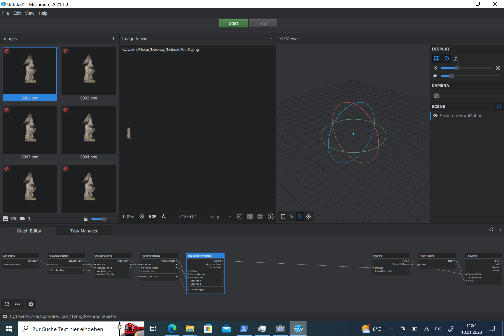
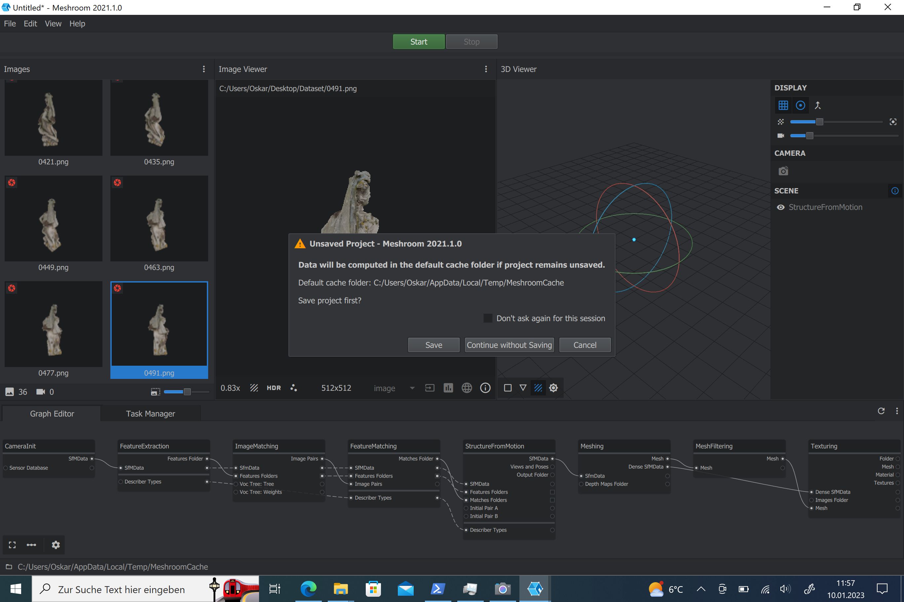

# Mehsroom-tut
---
## 1. Bilder hinzufügen

Zuerst müssen die Bilder die für den 3D-Scan verwendet werden sollen in die Bilder-Ablage Gezogen werden.

## 1.1 (nur für nutzer ohne Nvidia Grafikkarte)

Die 3 Nodes mit den Tieln: "PrepareDenseScene", "DepthMap" und "DepthMapFilter" müssen entfernt werden, da diese eine Cuda-Fähige (Nvidia) Graffikarte benötigen. Die Nodes können mit einem Rechtsklick und einem Folge-Klick auf "Delete Node" Gelöscht Werden.

## 1.2 (nur für nutzer ohne Nvidia Grafikkarte)

## 2
